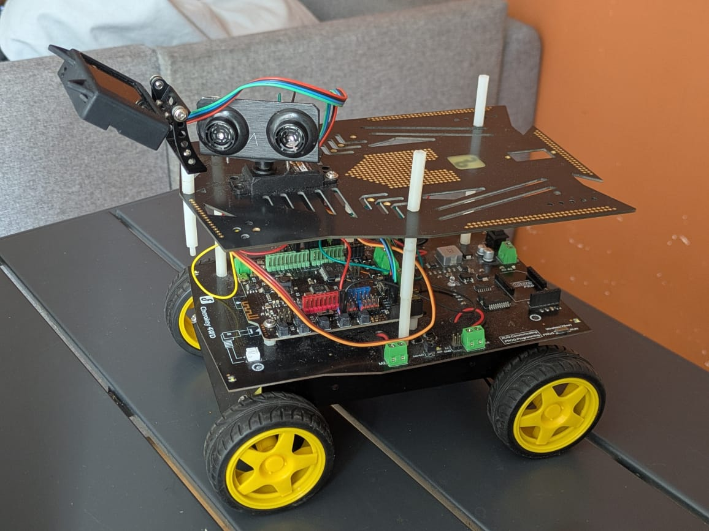

# Étape 1 : Résolution du Labyrinthe 🧭

Ce dossier contient le code et les ressources nécessaires pour la première étape du projet : la résolution d'un labyrinthe de manière autonome à l'aide du robot mobile **Cherokey 4WD**.

## 📸 Présentation du Robot
Voici le robot complet configuré pour cette épreuve :

---

## 🛠️ Matériel et Câblage
Le robot utilise un servomoteur pour orienter un capteur de distance à ultrasons afin de scanner l'environnement (gauche, centre, droite) et prendre des décisions d'évitement.

### Tableau des connexions (Pins)

| Composant | Fonction / Broche Arduino | Type de Pin |
| :--- | :--- | :--- |
| **Moteur 1 (M1)** | Vitesse (`speedPin_M1`) : **Pin 5**   Direction (`directionPin_M1`) : **Pin 4** | PWM   Numérique |
| **Moteur 2 (M2)** | Vitesse (`speedPin_M2`) : **Pin 6**   Direction (`directionPin_M2`) : **Pin 7** | PWM   Numérique |
| **Servo moteur** | Signal servo : **Pin 9** | Servo |
| **Capteur Ultrasons** | Écho (`URPWM`) : **Pin 3**   Déclencheur (`URTRIG`) : **Pin 10** | Entrée Numérique   Sortie Numérique |

### Schéma Électronique
Voici le plan de câblage des composants sur le châssis :

---

## 🧠 Logique de l'Algorithme
1. **Scan initial :** Le robot avance par défaut tant que la voie est libre.
2. **Détection d'obstacle :** Si le capteur à ultrasons détecte un mur à moins d'une distance critique, le robot s'arrête.
3. **Prise de décision :** Le servomoteur oriente le capteur à gauche puis à droite pour mesurer l'espace disponible.
4. **Action :** Le robot pivote vers la direction offrant le plus de dégagement, puis reprend sa marche avant.
